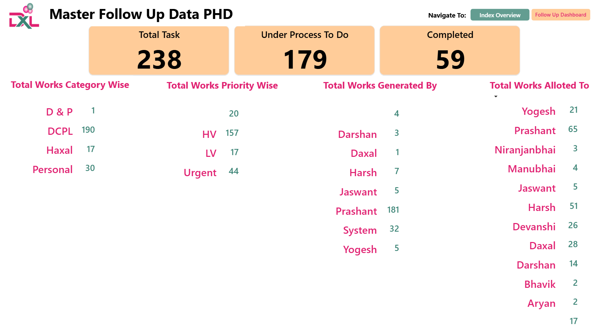
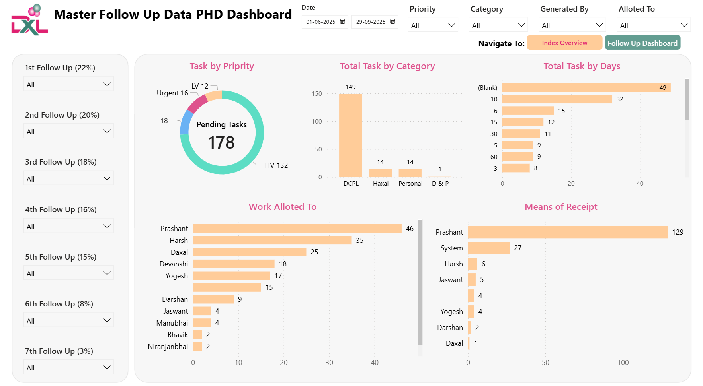

# 📊 Blinkit Sales & Insights Dashboard

An interactive Power BI dashboard built to analyze Blinkit’s sales patterns, outlet performance, product categories, and delivery efficiency.
It helps business owners make faster, smarter decisions — just like Blinkit delivers in minutes, this dashboard delivers insights at the same speed.  

## 📸 Screenshots  

### Landing Page  
 

### Overview Insights

### Detailed Insights

---

## 🚀 Project Overview
- Tracks Total Sales, Avg Sales, Total Items, Avg Ratings, Avg Delivery Time
- Breaks down insights by Item Type, Outlet Type, Fat Content, Outlet Size, and Location Tier
- Includes custom filter pane, clean navigation buttons, and a Blinkit-themed UI
- Helps identify top-selling categories, delivery bottlenecks, outlet performance, and more  

---

## 🛠 Tools & Technologies
- **Power BI** – dashboard design & visualizations  
- **DAX** – measures, KPIs, time-intelligence  
- **Excel** – data source
- **Json** – data source  

---

## 🔑 The Problem
- Hard to understand category performance, delivery trends, and outlet strengths from raw data 
- No quick way to compare sales across multiple item types and outlet locations 
- Decision-making was slow due to scattered data 

---

## ✅ The Solution
- Built a complete Blinkit-style analytical dashboard for faster decision making 
- Highlighted **sales trends, outlet behavior, rating quality, and delivery efficiency**
- Provided clean visuals to make insights **easy, fast, and actionable**

---

## 📬 Contact  
👤 **Aryan Patel**  
- 💼 Power BI Developer | Full Stack Developer  
- 🔗 [LinkedIn](www.linkedin.com/in/aryan-patel-ap02)
- 🔗 [Portfolio](https://www.datascienceportfol.io/aryan_dharmesh_patel)
- 📧 aryanpatelaryan81@gmail.com
